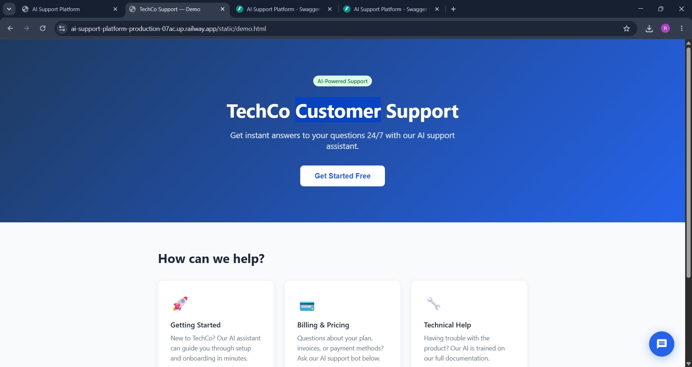
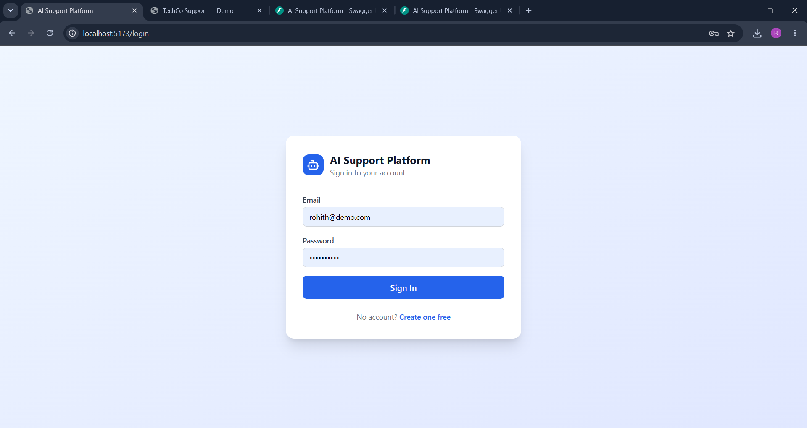
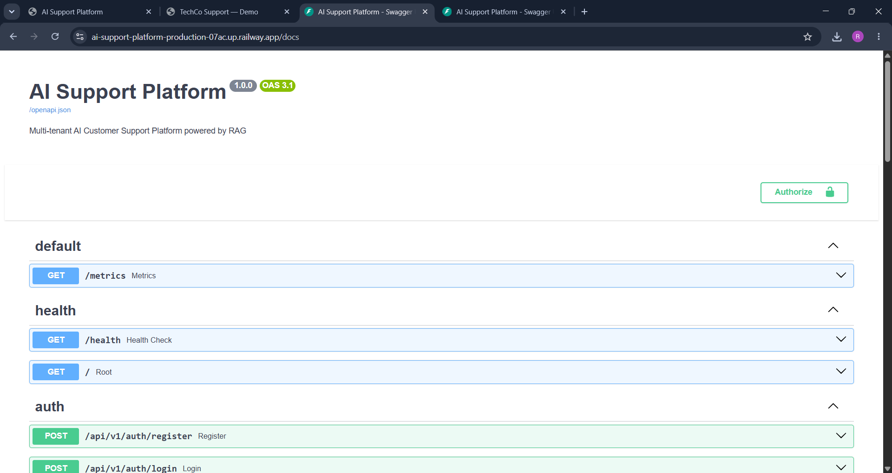
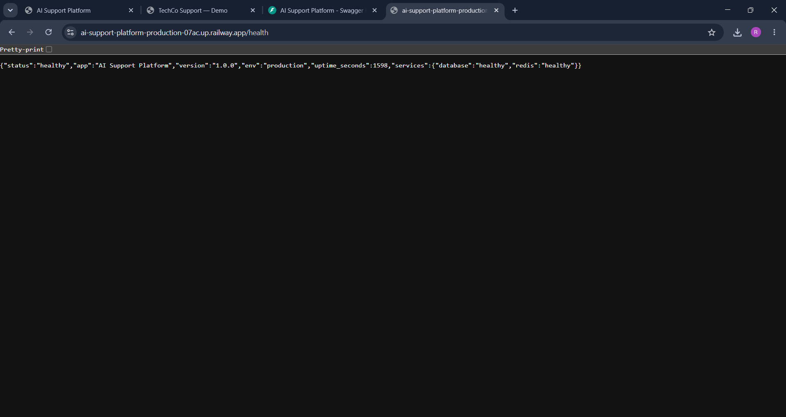

# AI Customer Support Platform

> A production-grade, multi-tenant SaaS platform — built solo from scratch in 7 days.

[](https://python.org)
[](https://fastapi.tiangolo.com)
[](https://postgresql.org)
[](https://react.dev)
[](https://railway.app)
[](https://github.com/features/actions)

**Live API:** https://ai-support-platform-production-07ac.up.railway.app/docs  
**Live Demo:** https://ai-support-platform-production-07ac.up.railway.app/static/demo.html  
**GitHub:** https://github.com/RohithkumarReddipogula/ai-support-platform

---

## Live Demo



Visit the live demo and click the chat bubble in the bottom right corner:  
**https://ai-support-platform-production-07ac.up.railway.app/static/demo.html**

---

## Dashboard



---

## API Documentation



Full interactive API available at:  
**https://ai-support-platform-production-07ac.up.railway.app/docs**

---

## Health Monitoring



Live health check at `/health` — shows PostgreSQL and Redis status with uptime in seconds.

---

## What This Does

Any business signs up, uploads their support documents (FAQs, manuals, policies), and gets an AI-powered support chatbot they can embed on their website with a single line of code.

Each business gets their own isolated knowledge base, API key, and conversation history. The same RAG engine powers both the dashboard chat and the public embeddable widget.

---

## How It Works

```
Customer types a question in the widget
            |
            v
POST /api/v1/chat/widget  (authenticated by tenant API key)
            |
            v
Full-text search across tenant document chunks in PostgreSQL
            |
            v
Top 5 relevant chunks retrieved and injected as context
            |
            v
Response generated with source citations
            |
            v
Answer streams back word by word (ChatGPT-like effect)
```

---

## Tech Stack

| Layer | Technology | Why I chose it |
|---|---|---|
| Backend API | FastAPI + Python 3.11 | Async-native, automatic OpenAPI docs, type safety |
| Database | PostgreSQL 16 + pgvector | Relational data + vector search in a single system |
| Authentication | JWT access + refresh tokens | Stateless, production-standard auth |
| Frontend | React + Vite + TailwindCSS | Fast builds, component-based UI |
| Infrastructure | Docker Compose | One command to run the entire stack locally |
| CI/CD | GitHub Actions | Automated tests + Docker build on every push |
| Monitoring | Prometheus /metrics + /health | Real-time service observability |
| Deployment | Railway.app | Automated deploys from GitHub with managed databases |

---

## Features

**Multi-tenant isolation** — Each business account gets its own knowledge base, API key, and conversation history. No data crosses tenant boundaries.

**Document ingestion pipeline** — Upload PDF, TXT, or DOCX. The platform extracts text, splits it into 400-word chunks, stores them in PostgreSQL, and tracks status (pending → completed / failed).

**RAG chat engine** — Every question triggers a full-text search across the tenant's document chunks. Retrieved context is injected into the prompt. Every response includes source citations.

**Streaming responses** — Responses stream word by word using Server-Sent Events — the same effect as ChatGPT. The frontend reads the stream and updates the UI in real time.

**Embeddable JavaScript widget** — A standalone 200-line vanilla JS widget. Any website embeds it with one script tag:

```html
<script src="https://ai-support-platform-production-07ac.up.railway.app/static/widget.js"
        data-api-key="sk_your_key_here"></script>
```

**Public widget API** — `/api/v1/chat/widget` authenticates via tenant API key instead of JWT, so the widget works for anonymous website visitors.

**Health monitoring** — `/health` returns live PostgreSQL and Redis status with uptime. `/metrics` exposes Prometheus data for all endpoints.

---

## API Reference

| Method | Endpoint | Auth | Description |
|---|---|---|---|
| POST | /api/v1/auth/register | Public | Register user + create tenant |
| POST | /api/v1/auth/login | Public | Login, receive JWT tokens |
| POST | /api/v1/auth/refresh | Public | Refresh access token |
| GET | /api/v1/auth/me | JWT | Get current user and tenant API key |
| POST | /api/v1/documents/upload | JWT | Upload and process document |
| GET | /api/v1/documents | JWT | List knowledge base documents |
| DELETE | /api/v1/documents/{id} | JWT | Remove document and chunks |
| POST | /api/v1/chat | JWT | RAG chat with source citations |
| POST | /api/v1/chat/stream | JWT | Streaming chat — SSE word-by-word |
| GET | /api/v1/chat/history/{id} | JWT | Retrieve conversation history |
| POST | /api/v1/chat/widget | API Key | Public widget endpoint |
| GET | /health | Public | Database and Redis health check |
| GET | /metrics | Public | Prometheus metrics |

---

## Running Locally

```bash
git clone https://github.com/RohithkumarReddipogula/ai-support-platform
cd ai-support-platform
cp .env.example .env
# Add a SECRET_KEY (any 32+ character string) to .env
docker compose up --build
```

| Service | URL |
|---|---|
| React Dashboard | http://localhost:5173 |
| API Docs | http://localhost:8000/docs |
| Health Check | http://localhost:8000/health |
| Demo Widget | http://localhost:8000/static/demo.html |

---

## Running Tests

```bash
cd backend
pip install pytest pytest-asyncio httpx
pytest tests/ -v
```

12 tests covering authentication, document upload, RAG chat, session continuity, and the public widget endpoint.

---

## Project Structure

```
ai-support-platform/
├── backend/
│   ├── app/
│   │   ├── api/v1/
│   │   │   ├── auth.py        # Register, login, refresh, profile
│   │   │   ├── chat.py        # RAG chat + streaming SSE endpoint
│   │   │   ├── documents.py   # Upload, list, delete documents
│   │   │   ├── widget.py      # Public widget API (API key auth)
│   │   │   └── health.py      # Health check + Prometheus
│   │   ├── core/
│   │   │   ├── auth.py        # JWT dependency injection
│   │   │   └── security.py    # Password hashing, token creation
│   │   ├── models/            # SQLAlchemy models
│   │   ├── schemas/           # Pydantic schemas
│   │   ├── services/
│   │   │   └── rag.py         # Document retrieval logic
│   │   └── static/
│   │       ├── widget.js      # Embeddable widget (vanilla JS)
│   │       └── demo.html      # Live demo page
│   ├── tests/
│   │   └── test_all.py        # 12 pytest tests
│   ├── Dockerfile
│   └── requirements.txt
├── frontend/
│   └── src/
│       ├── pages/             # Login, Register, Dashboard
│       ├── hooks/             # useAuth context
│       └── services/          # Axios API client
├── docs/
│   └── images/                # Screenshots
├── docker-compose.yml
└── .github/workflows/ci.yml
```

---

## Build Timeline

| Day | What I built |
|---|---|
| Day 1 | FastAPI setup, PostgreSQL + pgvector, JWT auth, Docker Compose, GitHub Actions CI |
| Day 2 | Document upload, text extraction, chunking pipeline, status tracking |
| Day 3 | RAG retrieval, chat endpoint, source citations, conversation history |
| Day 4 | React dashboard — login, registration, document management, live chat |
| Day 5 | Embeddable JS widget, public widget API, demo page |
| Day 6 | 12 pytest tests, Prometheus monitoring, health endpoint with uptime |
| Day 7 | Railway deployment, streaming SSE responses, live public URL |

---

## Author

**Rohith Kumar Reddipogula**  
MSc Data Science — University of Europe for Applied Sciences, Potsdam (2026)  
NLP · RAG Systems · ML Engineering · Python · FastAPI · React

[GitHub](https://github.com/RohithkumarReddipogula) &nbsp;|&nbsp;
[LinkedIn](https://www.linkedin.com/in/rohith-kumar-reddipogula-a6692030b/) &nbsp;|&nbsp;
[Portfolio](https://rohithkumarreddipogula.github.io) &nbsp;|&nbsp;
[Live RAG Demo](https://rohith2026-hybrid-rag-demo.hf.space)
